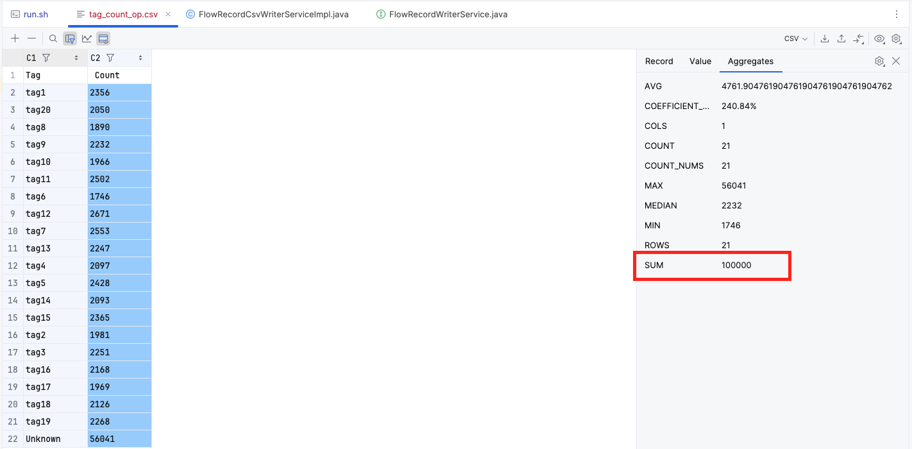
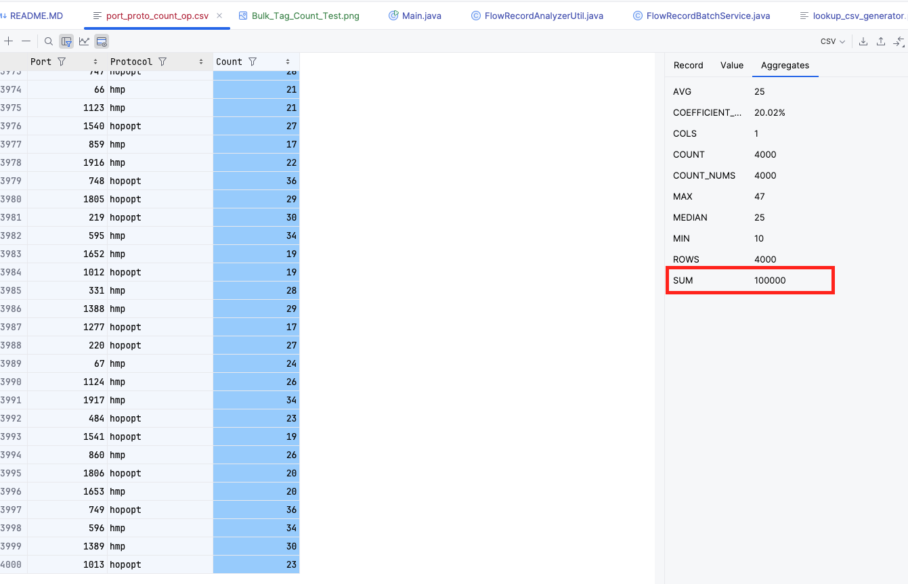

# Illumio Technical Assessment

## Problem Overview

The goal of this problem is to develop a program that processes flow log data and categorizes each log entry based on a predefined mapping found in a lookup table. The lookup table is provided as a CSV file, where each entry specifies a combination of destination port (`dstport`) and protocol (`protocol`), along with a corresponding tag (`tag`). The program will parse the flow log data, apply the relevant tag based on the port and protocol combination, and then produce two output files that summarizes the results.


## Project Structure
The project is mainly written in Java. I have used Python for scripting to generate log files and the lookup table. These scripts can be found under the "scripts" directory.


- **`src/` Directory**:  
  Contains all the Java source files. The main application logic resides here, including classes responsible for file I/O, data parsing, and output generation. Key components include:

    - **`FlowRecordBatchService.java`**:  
      This class is designed to handle the batch processing of flow log entries. It takes a batch size and a filename as input in the constructor. The `getBatchFlowRecords` method returns a list of flow log entries, with the list size corresponding to the specified batch size. This service is crucial for efficiently handling large flow log files by processing them in manageable chunks.

    - **`FlowRecordWriterService.java`**:  
      This is an interface that defines the necessary functions for exporting the results. It abstracts the output mechanism, allowing for different implementations to handle various output formats or destinations.

    - **`FlowRecordCsvWriterServiceImpl.java`**:  
      This class implements the `FlowRecordWriterService` interface. It provides a concrete implementation to export the processed data into CSV files. This implementation ensures that the output data is correctly formatted and written to files that can be easily analyzed or integrated with other systems.

    - **`FlowRecordAnalyzerUtil.java`**:  
      This utility class contains various helper methods essential for data processing tasks. Key functionalities include extracting data from the lookup CSV file and managing the mapping between protocol IDs and their corresponding protocol strings. This class plays a pivotal role in ensuring the accuracy and efficiency of the data parsing and tagging processes.

- **`scripts/` Directory**:  
  Contains Python scripts used for generating test data:

    - **`flow_log_generator.py`**:  
      This script generates sample flow log files that simulate real network traffic data. It is useful for testing and validating the Java application's ability to correctly parse and process various types of flow logs under different scenarios.

    - **`lookup_csv_generator.py`**:  
      This script creates a CSV lookup table containing combinations of ports, protocols, and their corresponding tags. It allows for the generation of custom lookup tables that can be used to test how well the Java application maps flow log entries to tags based on different criteria.

## Assumptions

Below are the assumptions that I have made.

* For the second output file, I have assumed that the specified port refers to the destination port.
* In cases where a CSV or log entry is malformed, the corresponding record will be skipped.
* If there is no occurrence of a given tag, the entry will not be included in the output file.
* As outlined in the assignment, this application only supports flow logs with the default version 2.

## Usage

To run the application execute the below commands.   
```
git clone https://github.com/abhijithkrishnan0/IllumioAssessment.git

cd IllumioAssessment; ./run.sh
```

The output files can be viewed in the "tag_count_op.csv" & the "port_proto_count_op.csv"

To run the program with custom log files and lookup files, modify the "run.sh" file. 

### Program usage

The project is developed in Java and requires five input arguments to run:

**Note**: These arguments do not need to be manually provided if you are executing the project through the provided shell script.

1. **Batch Size**:  
   Specifies the number of records to be processed in each iteration.

2. **Flowlog File**:  
   The path to the flow log file, which is stored within the project directory.

3. **Lookup File**:  
   The path to the lookup table or CSV file used for mapping flow log entries to tags.

4. **Output File 1**:  
   The path where the first output file will be generated, containing the count of occurrences for each tag in the flow log.

5. **Output File 2**:  
   The path where the second output file will be generated, listing the count of occurrences for each destination port and protocol pair.


## Testing


### How do I know my output is correct?
With  large workloads, it is impossible to verify the results manually. Therefore, I did a check on the total counts on each csv file.
With smaller workloads(with 20 logs and 10 entries in the lookup file), I manually checked the occurrences of each tag and port-protocol mappings.  


### When to skip processing a record?

If a log record does not contain the required 14 entries, as specified in the default log format mentioned in the assignment, the application will skip that log entry. Additionally, the application will skip entries that fail type validation. For example, if the start time contains a value like ‘abc,’ that entry will be ignored. The same rule applies to the lookup CSV, where we expect exactly three entries in the specified format. 

### How does application scale with large files

I have tested this application using the provided flow log and have also stress-tested it under various loads. Thanks to the batch processing capabilities of this project, it can handle very large files; the largest file I tested was 45MB. For the lookup table, I conducted tests with 50,000 entries, and the program completed successfully. However, by design, the application loads the entire lookup table into memory, which may limit its scalability with significantly larger lookup tables. In such cases, we would need to design a distributed solution to split the lookup table and perform a MapReduce-type operation.

Below are the results from the bulk test with 100,000 log entries (approximately 10MB log file size). The highlighted sum confirms that all log records were processed and successfully mapped.





